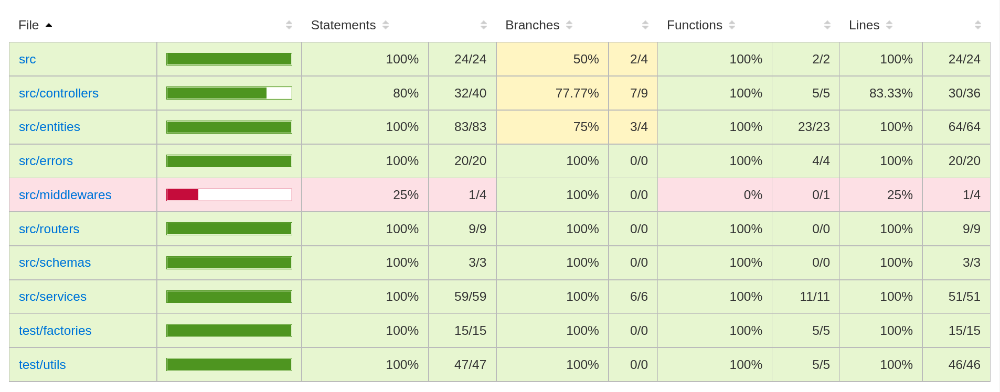
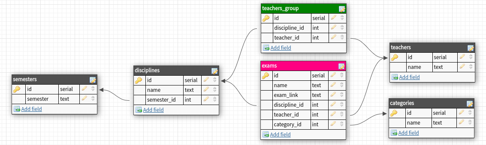

<p align="center" >
    
</p>

  

# repop

O repop é uma aplicação backend desenvolvida para gerenciar os dados de um repositório público onde estudantes podem compartilhar provas uns com os outros.
Essa aplicação foi feita para servir o web app repof, <a href="https://github.com/YoYolops/repof" target="_blank">você pode achá-lo clicando aqui</a>.

### Tecnologias usadas:


### Cobertura de testes
<p align="center" >
    
</p>

### DB design
<p align="center" >
    
</p>

## Rotas:

- **POST `/exams`**
    
    Adiciona uma nova prova, não é necessário nenhum tipo de autenticação para enviar provas, o formato do body deve ser: .
    
    ```json
    {
      "name": "2020.1",
      "examLink": "https://linkpropdf.pdf",
      "disciplineId": 3,
      "teacherId": 6,
      "categoryId": 2,
    }
    ```
    
    O retorno é um id da prova cadastrada
    
    ```json
    {
      "id": 6
    }
    ```
    
- **GET `/exams/teacher`**
    
    Retorna um array com todas as provas cadastradas, organizadas por professor, seguindo o padrão:

    
    ```json
      {
          "id": 10,
          "name": "Crystal Sporer",
          "exams": [
            {
              "id": 1,
              "name": "2021.1",
              "examLink": "https://download.inep.gov.br/enem/provas_e_gabaritos/2021_PV_impresso_D1_CD1.pdf",
              "categoryName": "P1"
            },
            {
              "id": 11,
              "name": "2020.1",
              "examLink": "https://download.inep.gov.br/enem/provas_e_gabaritos/2021_PV_impresso_D1_CD1.pdf",
              "categoryName": "P1"
            }
          ]
        }
    ```
    
- **GET `/exams/discipline`**
    
    Retorna um array com todas as provas cadastradas, organizadas por disciplina, seguindo o padrão:

    
    ```json
        {
            "id": 1,
            "name": "Cálculo I",
            "semesterId": 1,
            "semester": "1",
            "teachers": [
              {
                "id": 10,
                "name": "Crystal Sporer"
              }
            ],
            "exams": [
              {
                "id": 1,
                "name": "2021.1",
                "examLink": "https://download.inep.gov.br/enem/provas_e_gabaritos/2021_PV_impresso_D1_CD1.pdf",
                "categoryId": 1,
                "categoryName": "P1",
                "teacher": "Crystal Sporer"
              }
            ]
          },
    ```
  
    
    
